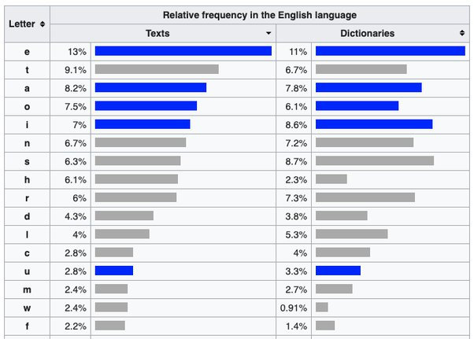
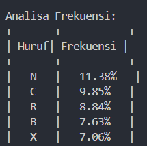
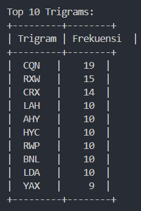
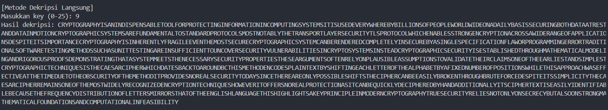
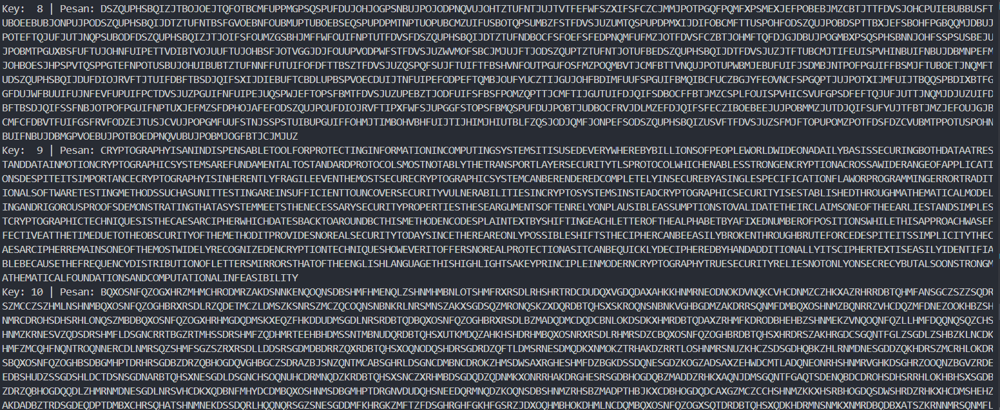
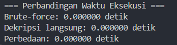

# Kriptanalisis Cipher Abjad-Tunggal 

> Soal : Di laboratorium KCKS, Cyber Fox yang penasaran, sedang menyelidiki sebuah anomali dalam sistem jaringan DTI. Saat menelusuri log, Cipher menemukan sebuah dokumen terenkripsi yang mencurigakan. Namun, ada satu masalah: teks dalam dokumen tersebut telah dikodekan menggunakan cipher substitusi abjad-tunggal (monoalphabetic cipher), dan kunci enkripsinya tidak diketahui. Untungnya, Cipher adalah ahli dalam kriptanalisis dan tahu bahwa metode ini bisa dipecahkan menggunakan analisis frekuensi dan terkaan kata. Jika diketahui bahwa bahasa yang digunakan dalam teks adalah bahasa inggris, bantulah Cyber Fox membuat tabel substitusi huruf dan mendekripsi teks sebelum waktunya habis!   
> Ciphertext :
> LAHYCXPAJYQHRBJWRWMRBYNWBJKUNCXXUOXAYAXCNLCRWPRWOXAVJCRXWRWLXVYDCRWPBHBCNVBRCRBDBNMNENAHFQNANKHKRUURXWBXOYNXYUNFXAUMFRMNXWJMJRUHKJBRBBNLDARWPKXCQMJCJJCANBCJWMMJCJRWVXCRXWLAHYCXPAJYQRLBHBCNVBJANODWMJVNWCJUCXBCJWMJAMYAXCXLXUBVXBCWXCJKUHCQNCAJWBYXACUJHNABNLDARCHCUBYAXCXLXUFQRLQNWJKUNBBCAXWPNWLAHYCRXWJLAXBBJFRMNAJWPNXOJYYURLJCRXWBMNBYRCNRCBRVYXACJWLNLAHYCXPAJYQHRBRWQNANWCUHOAJPRUNNENWCQNVXBCBNLDANLAHYCXPAJYQRLBHBCNVLJWKNANWMNANMLXVYUNCNUHRWBNLDANKHJBRWPUNBYNLRORLJCRXWOUJFXAYAXPAJVVRWPNAAXACAJMRCRXWJUBXOCFJANCNBCRWPVNCQXMBBDLQJBDWRCCNBCRWPJANRWBDOORLRNWCCXDWLXENABNLDARCHEDUWNAJKRURCRNBRWLAHYCXBHBCNVBRWBCNJMLAHYCXPAJYQRLBNLDARCHRBNBCJKURBQNMCQAXDPQVJCQNVJCRLJUVXMNURWPJWMARPXAXDBYAXXOBMNVXWBCAJCRWPCQJCJBHBCNVVNNCBCQNWNLNBBJAHBNLDARCHYAXYNACRNBCQNBNJAPDVNWCBXOCNWANUHXWYUJDBRKUNJBBDVYCRXWBCXEJURMJCNCQNRALUJRVBXWNXOCQNNJAURNBCJWMBRVYUNBCLAHYCXPAJYQRLCNLQWRZDNBRBCQNLJNBJALRYQNAFQRLQMJCNBKJLTCXJAXDWMKLCQRBVNCQXMNWLXMNBYUJRWCNGCKHBQROCRWPNJLQUNCCNAXOCQNJUYQJKNCKHJORGNMWDVKNAXOYXBRCRXWBFQRUNCQRBJYYAXJLQFJBNOONLCRENJCCQNCRVNMDNCXCQNXKBLDARCHXOCQNVNCQXMRCYAXERMNBWXANJUBNLDARCHCXMJHBRWLNCQNANJANXWUHYXBBRKUNBQROCBCQNLRYQNALJWKNNJBRUHKAXTNWCQAXDPQKADCNOXALNMNBYRCNRCBBRVYURLRCHCQNLJNBJALRYQNAANVJRWBXWNXOCQNVXBCFRMNUHANLXPWRINMNWLAHYCRXWCNLQWRZDNBQXFNENARCXOONABWXANJUYAXCNLCRXWJBRCLJWKNZDRLTUHMNLRYQNANMKHQJWMJMMRCRXWJUUHRCBLRYQNACNGCRBNJBRUHRMNWCRORJKUNKNLJDBNCQNOANZDNWLHMRBCARKDCRXWXOUNCCNABVRAAXABCQJCXOCQNNWPURBQUJWPDJPNCQRBQRPQURPQCBJTNHYARWLRYUNRWVXMNAWLAHYCXPAJYQHCADNBNLDARCHANURNBWXCXWUHXWBNLANLHKDCJUBXXWBCAXWPVJCQNVJCRLJUOXDWMJCRXWBJWMLXVYDCJCRXWJURWONJBRKRURCH

## File

- `frequencycip.py`: Skrip utama yang berisi fungsi untuk memberikan data analisa frekuensi dari _Ciphertext_.
- `compdecrypt.py`: Skrip utama yang berisi fungsi untuk melakukan dekripsi pada _Ciphertext_ dengan cara _Brute Force_ dan _Direct_ (menggunakan key).

## Cara Kerja

1. **Analisa Frekuensi**

    - Menjalankan program `frequencycip.py`
    - Agar konsistensi dari ciphertext terjaga, program melakukan _cleaning_ dengan menghapus spasi serta newline untuk kemudian di konversi ke huruf kapital.
    - Program menggunakan `Counter` untuk melakukan perhitungan pada setiap hurufnya untuk kemudian dihitung berdasarkan frekuensi relatif.
    - Dilakukan analisa Trigram (Tiga huruf yang sering muncul bersamaan).

2. **Dekripsi dengan Kunci (Key)**

    - Fungsi `caesar_decrypt_direct` akan bekerja dengan membutuhkan key untuk melakukan dekripsi yang lebih "terarah".
    - Program akan melakukan _pre-compute_ `ord('A')` dan `ord('a')` untuk efisiensi
    - Dilakukan normalisasi pada key menggunakan modulo `key % 26` untuk _handling_ nilai diluar range 0-25 (jumlah alfabetikal).
    - Program akan melakukan konversi dari _Ciphertext_ ke _Plaintext_ dengan key yang telah diberikan

3. **Dekripsi dengan _Brute Force_**

    - Fungsi `caesar_decrypt_bruteforce` akan melakukan seluruh kalkulasi kemungkinan untuk memecahkan _Ciphertext_
    - Program akan membuat string hasil dekripsi sementara dan akan disimpan pada list `results` untuk menyimpan semua kemungkinan hasil
    - Program akan melakukan pergesera pada setiap huruf sesuai dengan nilai `shift`
    - `shift` bernilai 0-25 sesuai jumlah alfabetikal
    - Rumus dekripsi
    -     chr((ord(char) - ord('A') - shift) % 26 + ord('A'))  # Huruf kapital
    -     chr((ord(char) - ord('a') - shift) % 26 + ord('a'))  # Huruf kecil

## Pre-Requisite

- **Tabel Frekuensi Bahasa Inggris**

***Noted*** : Tabel diatas akan digunakan untuk menemukan key dari soal menggunakan teknik analisa frekuensi.

## Langkah Pengerjaan Soal

1. Dilakukan analisa frekuensi analisa terlebih dahulu dengan menjalankan program `frequencycip.py`

2. Karena terlihat bahwa `N` menjadi huruf yang sering muncul pada _Ciphertext_, maka jika kita cocokkan dengan tabel yang ada di [_Pre-Requisite_](#pre-requisite) akan timbul sebuah asumsi dimana E = N. Dengan kata lain, maka _Plaintext_ adalah 9x pergeseran ke kiri dari _Ciphertext_. Dengan demikian maka kita dapat membuat tabel berikut

### Tabel Pergeseran Alfabet (Kunci = 9)

| Plaintext | Ciphertext |
|-----------|------------|
| A         | J          |
| B         | K          |
| C         | L          |
| D         | M          |
| E         | N          |
| F         | O          |
| G         | P          |
| H         | Q          |
| I         | R          |
| J         | S          |
| K         | T          |
| L         | U          |
| M         | V          |
| N         | W          |
| O         | X          |
| P         | Y          |
| Q         | Z          |
| R         | A          |
| S         | B          |
| T         | C          |
| U         | D          |
| V         | E          |
| W         | F          |
| X         | G          |
| Y         | H          |
| Z         | I          |

3. Menjalankan program `compdecrypt.py` untuk melakukan dekripsi pada _Ciphertext_, gunakan angka 9 sebagai _key_ untuk melakukan dekripsi terarah.

## Output

1. **Hasil _Direct Decryption_**

2. **Hasil _Brute Force_**

3. **Perbandingan Waktu**

> Hasil Decrypt : Cryptography is an indispensable tool for protecting information in computing systems. It is used everywhere by billions of people worldwide on a daily basis, securing both data at rest and data in motion. Cryptographic systems are fundamental to standard protocols, most notably the Transport Layer Security (TLS) protocol, which enables strong encryption across a wide range of applications.  
>  
> Despite its importance, cryptography is inherently fragile. Even the most secure cryptographic system can be rendered completely insecure by a single specification flaw or programming error. Traditional software testing methods, such as unit testing, are insufficient to uncover security vulnerabilities in cryptosystems. Instead, cryptographic security is established through mathematical modeling and rigorous proofs, demonstrating that a system meets the necessary security properties. These arguments often rely on plausible assumptions to validate their claims.  
>  
> One of the earliest and simplest cryptographic techniques is the Caesar cipher, which dates back to around 100 BC. This method encodes plaintext by shifting each letter of the alphabet by a fixed number of positions. While this approach was effective at the time due to the obscurity of the method, it provides no real security today. Since there are only 25 possible shifts, the cipher can be easily broken through brute force.  
>  
> Despite its simplicity, the Caesar cipher remains one of the most widely recognized encryption techniques. However, it offers no real protection as it can be quickly deciphered by hand. Additionally, its ciphertext is easily identifiable because the frequency distribution of letters mirrors that of the English language. This highlights a key principle in modern cryptography: true security relies not only on secrecy but also on strong mathematical foundations and computational infeasibility.

## Perbandingan Waktu

Dari hasil yang terlihat, nampak bahwa perbandingan waktu tidak akan terasa mengingat bahwa Caesar Cipher merupakan salah satu cipher yang mudah untuk di-_crack_ oleh sebuah algoritma.
