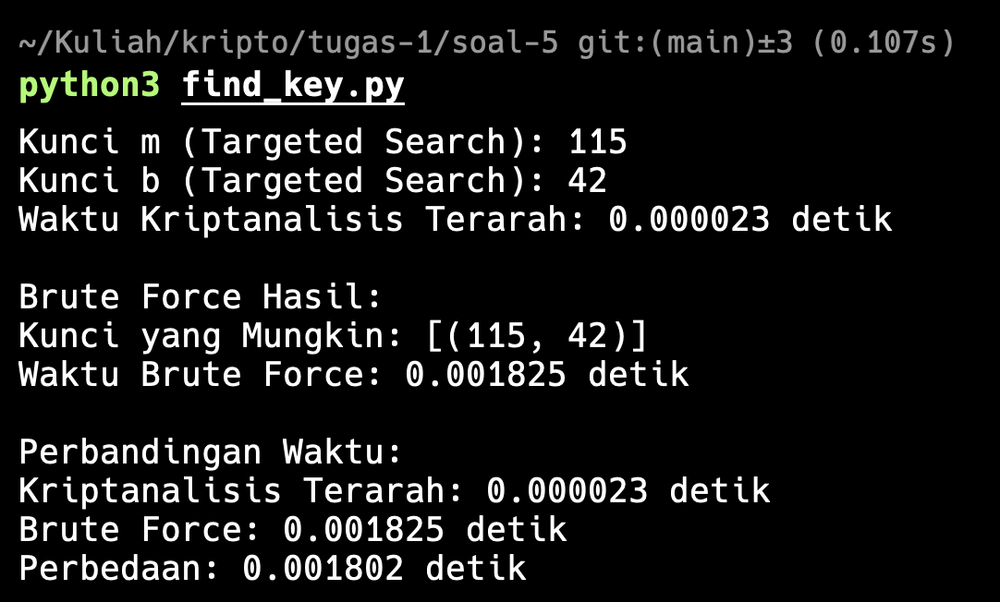

# Dekripsi Gambar dengan Cipher Affine

Program ini berisi skrip Python untuk mendekripsi gambar yang telah dienkripsi menggunakan cipher affine. Cipher affine adalah jenis cipher substitusi monoalfabetik, di mana setiap byte dalam gambar dienkripsi menggunakan fungsi matematika sederhana.

## File

- `decrypt_image.py`: Skrip utama yang berisi fungsi untuk menemukan kunci affine dan mendekripsi gambar.

## Cara Kerja

1. **Menemukan Kunci Affine**:

   - Fungsi `find_affine_key(p1, c1, p2, c2, n)` menghitung kunci affine `(m, b)` berdasarkan dua pasang plaintext-ciphertext yang diketahui.
   - Kunci affine terdiri dari dua parameter: `m` (slope) dan `b` (intercept).
   - Fungsi ini menggunakan invers modular untuk menghitung nilai `m`.

2. **Dekripsi Gambar**:
   - Fungsi `decrypt_affine_image(input_path, output_path, m, b, n)` membaca file gambar terenkripsi, mendekripsi setiap byte, dan menyimpan hasilnya ke file baru.
   - Dekripsi dilakukan dengan rumus: `P = (m^(-1) * (C - b)) mod n`, di mana:
     - `P` adalah byte plaintext (asli)
     - `C` adalah byte ciphertext (terenkripsi)
     - `m^(-1)` adalah invers modular dari `m`
     - `n` adalah modulus (256 untuk byte)

## Parameter yang Digunakan

- Modulus (`n`) = 256 (rentang nilai byte)
- Pasangan plaintext-ciphertext pertama: (0xFF, 0xB7)
- Pasangan plaintext-ciphertext kedua: (0xD8, 0x32)

## Cara Penggunaan

1. Pastikan file gambar terenkripsi (`affinecipher.jpeg`) berada di direktori yang sama dengan skrip.
2. Jalankan skrip dengan perintah:

```sh
# Untuk mencari kunci gunakan:
  python3 find_key.py

# Untuk mendekripsi image gunakan:
   python3 decrypt_image.py
```

3. Gambar yang telah didekripsi akan disimpan sebagai `decrypted_image.jpg`.

## Output

1. Hasil pencarian kunci



2. Proses dekripsi image


## Catatan

- Program ini menggunakan operasi modular untuk enkripsi dan dekripsi.
- Invers modular dari `m` harus ada untuk dekripsi yang berhasil, yang berarti `m` dan `n` harus relatif prima.
